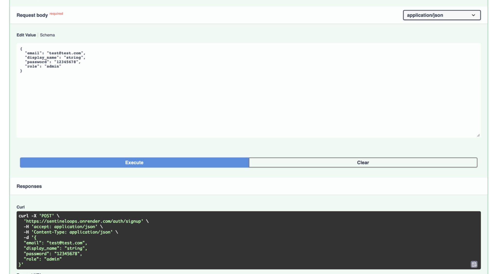
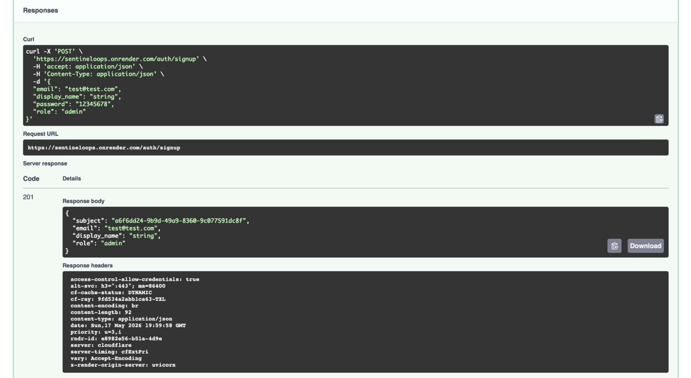
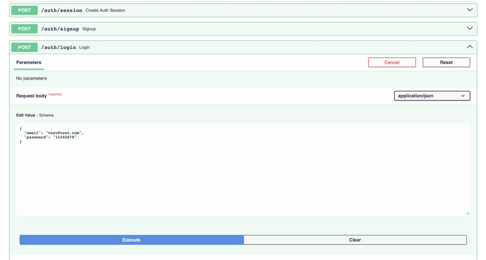
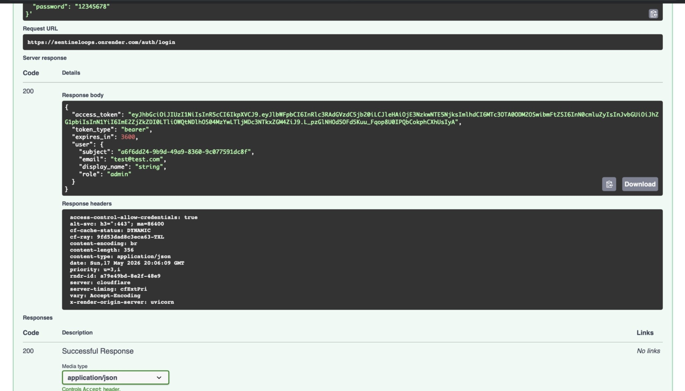
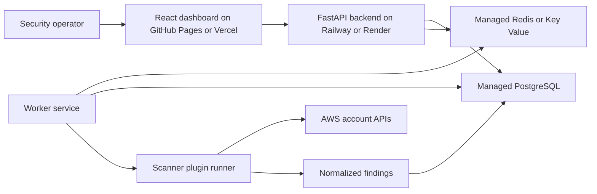

# SentinelOps

[](https://github.com/ramiabdu/Sentineloops/actions/workflows/ci.yml)


SentinelOps is a production-style Cloud Security Posture Management (CSPM) platform for detecting, analyzing, and prioritizing cloud security misconfigurations across cloud accounts.

It is built as a full-stack portfolio project with a deployed FastAPI backend, PostgreSQL persistence, JWT authentication, scanner plugin architecture, queued worker execution, responsive React dashboard, Docker local runtime, CI, release assets, and production-ready deployment configuration.

## Live API

- Swagger/OpenAPI docs: [https://sentineloops.onrender.com/docs](https://sentineloops.onrender.com/docs)
- Health check: [https://sentineloops.onrender.com/health](https://sentineloops.onrender.com/health)
- Public frontend demo: [https://ramiabdu.github.io/Sentineloops/](https://ramiabdu.github.io/Sentineloops/)

The Render API exposes interactive Swagger documentation for testing signup, login, and authenticated endpoints.

## Deployment & API Verification

The backend API is fully deployed on Render at `https://sentineloops.onrender.com`. PostgreSQL database integration is working, JWT authentication is implemented and verified, and Swagger/OpenAPI documentation is available publicly through the live `/docs` endpoint.

Current production status:

- Backend API: deployed on Render
- Database: PostgreSQL connected and used by signup/login persistence
- Authentication: JWT bearer authentication implemented and verified
- API documentation: Swagger/OpenAPI available at `/docs`
- Frontend demo: deployed on GitHub Pages
- CI: backend lint/tests and frontend build checks run in GitHub Actions

Production features:

- [x] FastAPI backend deployed on Render
- [x] PostgreSQL database connected
- [x] JWT Authentication
- [x] Protected routes
- [x] Swagger/OpenAPI docs
- [x] Signup/Login endpoints
- [x] Production environment variables configured

Example API calls:

```bash
curl https://sentineloops.onrender.com/health
```

```bash
curl -X POST https://sentineloops.onrender.com/auth/signup \
  -H "Content-Type: application/json" \
  -d '{"email":"finaluser@example.com","display_name":"Final User","password":"12345678","role":"viewer"}'
```

```bash
curl -X POST https://sentineloops.onrender.com/auth/login \
  -H "Content-Type: application/json" \
  -d '{"email":"finaluser@example.com","password":"12345678"}'
```

## Screenshots

### Production API Verification



<p><em>Swagger UI sends a public signup request to the deployed Render backend at <code>/auth/signup</code>.</em></p>



<p><em>Successful signup response from Render: the API returns <code>201 Created</code> and persists the user through PostgreSQL.</em></p>



<p><em>Swagger UI submits login credentials to the deployed <code>/auth/login</code> endpoint.</em></p>



<p><em>Successful login response from Render: the API returns <code>200 OK</code>, issues a JWT bearer token, and provides the authenticated user payload used for protected requests.</em></p>

### Product Dashboard


| Overview | Findings |
| --- | --- |
|  |  |

Mobile layout:


## Architecture



## Features

- Cloud account onboarding API and dashboard flow
- Scanner plugin contracts, registry, and runner
- AWS public S3 bucket scanner
- AWS public security group ingress scanner
- AWS IAM user without MFA scanner
- Findings persistence with deduplication
- First seen, last seen, and occurrence tracking
- Risk scoring for scanner findings
- Queued scan lifecycle and worker execution loop
- Findings list/detail APIs with filters
- Public signup, password login, JWT bearer sessions, and RBAC route checks
- Responsive dashboard with posture metrics, findings table, severity charts, risk cards, account inventory, and scan activity
- GitHub Actions CI for backend tests/lint and frontend typecheck/build
- Docker local stack with API, worker, PostgreSQL, and Redis

## Tech Stack

Backend:

- Python 3.12
- FastAPI
- SQLAlchemy
- Alembic
- PostgreSQL
- Redis-ready worker runtime
- Pydantic settings
- Uvicorn

Frontend:

- React 19
- TypeScript
- Vite
- CSS dashboard UI

Infrastructure and quality:

- Docker and Docker Compose
- Railway-ready backend and worker commands
- Render-ready free API blueprint with root and backend `requirements.txt`
- Vercel-ready frontend config
- Terraform baseline modules
- GitHub Actions CI
- Pytest and Ruff

## Repository Structure

```text
.
|-- backend/            # FastAPI app, models, repositories, services, scanners
|-- frontend/           # React/Vite dashboard
|-- workers/            # queued scan worker runtime
|-- docker/             # local compose stack
|-- terraform/          # baseline infrastructure modules
|-- docs/               # architecture, decisions, release notes, threat model
|-- tests/              # backend tests
|-- .github/            # CI and contribution templates
|-- render.yaml         # Render free backend preview blueprint
|-- railway.json        # Railway backend deployment config
|-- vercel.json         # Vercel frontend deployment config
|-- DEPLOYMENT.md
|-- SECURITY.md
|-- CONTRIBUTING.md
|-- ROADMAP.md
`-- CHANGELOG.md
```

## Local Setup

Bootstrap environment:

```bash
cp backend/.env.example backend/.env
cp frontend/.env.example frontend/.env
```

Run the backend locally:

```bash
cd backend
python -m pip install -e ".[dev]"
alembic upgrade head
python -m uvicorn app.main:app --reload
```

Run the frontend locally:

```bash
cd frontend
npm install
npm run dev
```

Run the worker locally:

```bash
PYTHONPATH=backend python -m workers.app.main
```

## Docker Setup

Start the full local stack:

```bash
make bootstrap
make up
```

Services:

- API: `http://localhost:8000`
- Health check: `http://localhost:8000/health`
- PostgreSQL: `localhost:5432`
- Redis: `localhost:6379`

Stop the stack:

```bash
make down
```

## Testing

Backend:

```bash
cd backend
python -m pytest ../tests/backend
python -m ruff check app ../tests/backend
```

Frontend:

```bash
cd frontend
npm run test
npm run build
```

## CI/CD

GitHub Actions runs on pushes and pull requests targeting `main`:

- backend dependency installation
- backend Ruff lint
- backend Pytest suite
- frontend TypeScript check
- frontend production build

Deployment configuration is prepared for:

- Frontend demo: GitHub Pages, currently live at `https://ramiabdu.github.io/Sentineloops/`
- Frontend: Vercel
- Backend API: Railway
- PostgreSQL: Railway Postgres
- Redis: Railway Redis
- Worker: Railway service
- Free backend preview: Render web service with Render Postgres and Render Key Value

## Security Notes

- Do not commit `.env` files or cloud credentials.
- Replace `AUTH_SECRET_KEY` in every non-local environment.
- Set `DEBUG=false` in production.
- Restrict `CORS_ALLOWED_ORIGINS` to the deployed frontend URL.
- Use least-privilege cloud credentials for scanner integrations.
- Treat the current signup/login flow as an MVP foundation, not a complete identity provider.

See [SECURITY.md](SECURITY.md) and [docs/threat-model.md](docs/threat-model.md).

## Roadmap

Near-term:

- Deploy public backend API and connect it to the frontend demo
- Add real identity provider integration
- Add old access key and missing encryption scanners
- Add audit log persistence
- Add alert delivery for high-severity findings

See [ROADMAP.md](ROADMAP.md).

## Contributing

Contributions should be small, tested, and aligned with the security product scope. See [CONTRIBUTING.md](CONTRIBUTING.md).

## Release

The [`v1.0.0`](https://github.com/ramiabdu/Sentineloops/tree/v1.0.0) release package is summarized in [docs/release-v1.0.0.md](docs/release-v1.0.0.md).

## License

MIT
