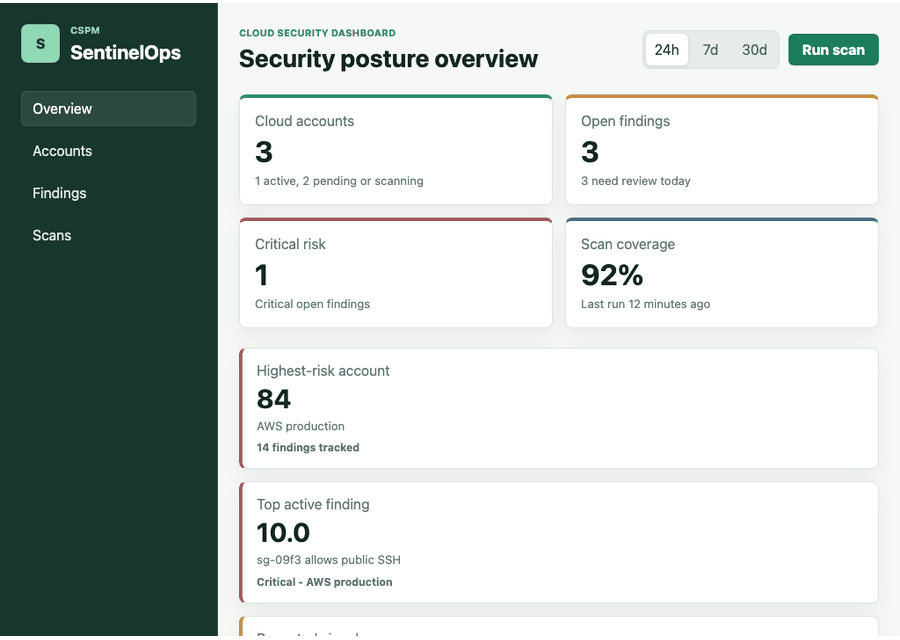
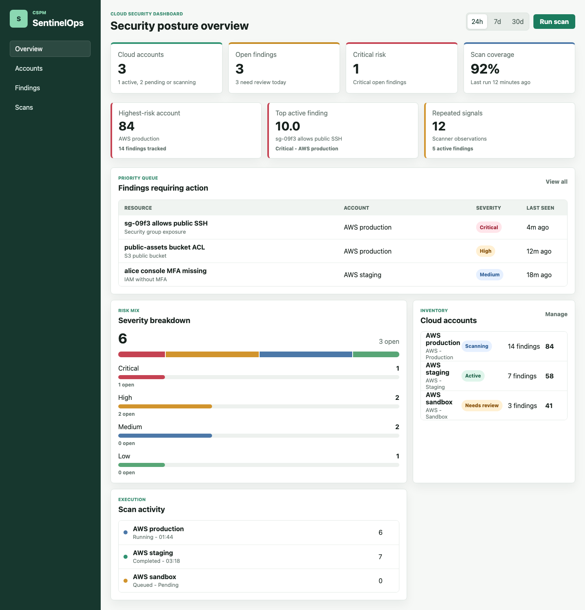
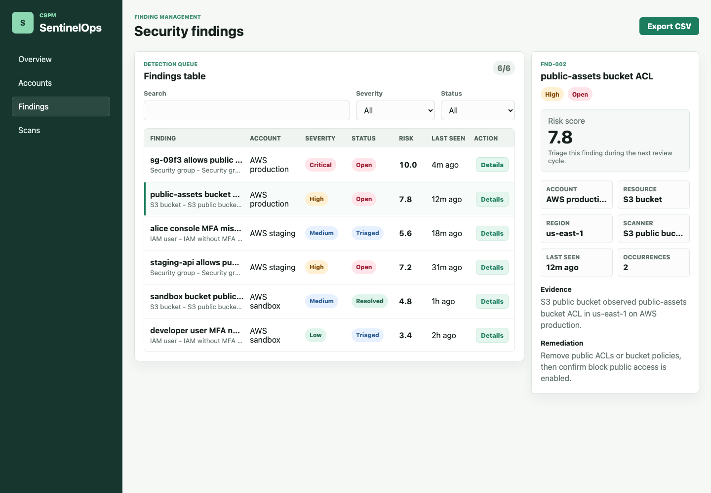
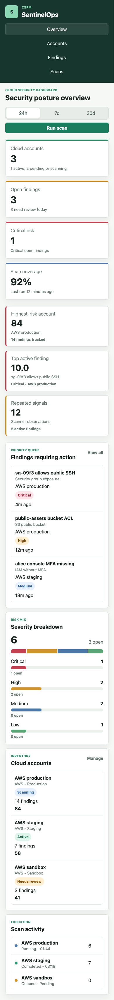
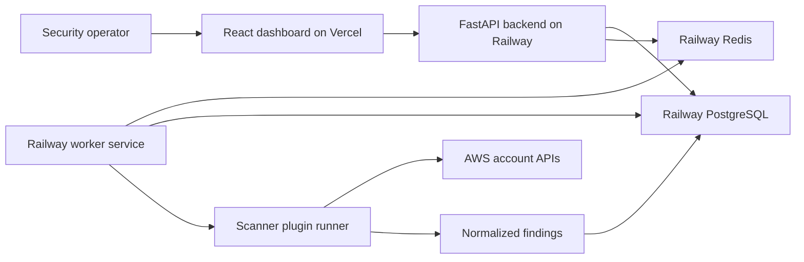

# SentinelOps

[](https://github.com/ramiabdu/Sentineloops/actions/workflows/ci.yml)


SentinelOps is a production-style Cloud Security Posture Management (CSPM) platform for detecting, analyzing, and prioritizing cloud security misconfigurations across cloud accounts.

It is built as a full-stack portfolio project with a FastAPI backend, scanner plugin architecture, PostgreSQL persistence, queued worker execution, responsive React dashboard, auth/RBAC foundation, Docker local runtime, CI, release assets, and deployment-ready configuration.

## Live Demo

Public frontend demo: [GitHub Pages](https://ramiabdu.github.io/Sentineloops/)

Backend API deployment: Not deployed yet.

The GitHub Pages demo is a static portfolio dashboard. Full backend deployment is prepared but still requires hosted PostgreSQL, Redis, and backend service credentials. See [DEPLOYMENT.md](DEPLOYMENT.md).

## Deployment Status

The frontend has a free GitHub Pages deployment workflow.

The backend API, PostgreSQL, Redis, and worker are deployment-ready but not publicly deployed yet. There is no live production API URL configured in this repository.

## Screenshots



| Overview | Findings |
| --- | --- |
|  |  |

Mobile layout:



## Architecture



## Features

- Cloud account onboarding API and dashboard flow
- Scanner plugin contracts, registry, and runner
- AWS public S3 bucket scanner
- AWS public security group ingress scanner
- AWS IAM user without MFA scanner
- Findings persistence with deduplication
- First seen, last seen, and occurrence tracking
- Risk scoring for scanner findings
- Queued scan lifecycle and worker execution loop
- Findings list/detail APIs with filters
- Mock bearer sessions and RBAC route checks
- Responsive dashboard with posture metrics, findings table, severity charts, risk cards, account inventory, and scan activity
- GitHub Actions CI for backend tests/lint and frontend typecheck/build
- Docker local stack with API, worker, PostgreSQL, and Redis

## Tech Stack

Backend:

- Python 3.12
- FastAPI
- SQLAlchemy
- Alembic
- PostgreSQL
- Redis-ready worker runtime
- Pydantic settings
- Uvicorn

Frontend:

- React 19
- TypeScript
- Vite
- CSS dashboard UI

Infrastructure and quality:

- Docker and Docker Compose
- Railway-ready backend and worker commands
- Vercel-ready frontend config
- Terraform baseline modules
- GitHub Actions CI
- Pytest and Ruff

## Repository Structure

```text
.
|-- backend/            # FastAPI app, models, repositories, services, scanners
|-- frontend/           # React/Vite dashboard
|-- workers/            # queued scan worker runtime
|-- docker/             # local compose stack
|-- terraform/          # baseline infrastructure modules
|-- docs/               # architecture, decisions, release notes, threat model
|-- tests/              # backend tests
|-- .github/            # CI and contribution templates
|-- DEPLOYMENT.md
|-- SECURITY.md
|-- CONTRIBUTING.md
|-- ROADMAP.md
`-- CHANGELOG.md
```

## Local Setup

Bootstrap environment:

```bash
cp backend/.env.example backend/.env
cp frontend/.env.example frontend/.env
```

Run the backend locally:

```bash
cd backend
python -m pip install -e ".[dev]"
alembic upgrade head
python -m uvicorn app.main:app --reload
```

Run the frontend locally:

```bash
cd frontend
npm install
npm run dev
```

Run the worker locally:

```bash
PYTHONPATH=backend python -m workers.app.main
```

## Docker Setup

Start the full local stack:

```bash
make bootstrap
make up
```

Services:

- API: `http://localhost:8000`
- Health check: `http://localhost:8000/health`
- PostgreSQL: `localhost:5432`
- Redis: `localhost:6379`

Stop the stack:

```bash
make down
```

## Testing

Backend:

```bash
cd backend
python -m pytest ../tests/backend
python -m ruff check app ../tests/backend
```

Frontend:

```bash
cd frontend
npm run test
npm run build
```

## CI/CD

GitHub Actions runs on pushes and pull requests targeting `main`:

- backend dependency installation
- backend Ruff lint
- backend Pytest suite
- frontend TypeScript check
- frontend production build

Deployment configuration is prepared for:

- Frontend demo: GitHub Pages
- Frontend: Vercel
- Backend API: Railway
- PostgreSQL: Railway Postgres
- Redis: Railway Redis
- Worker: Railway service

## Security Notes

- Do not commit `.env` files or cloud credentials.
- Replace `AUTH_SECRET_KEY` in every non-local environment.
- Set `DEBUG=false` in production.
- Restrict `CORS_ALLOWED_ORIGINS` to the deployed frontend URL.
- Use least-privilege cloud credentials for scanner integrations.
- Treat the current bearer auth as an MVP foundation, not a complete identity provider.

See [SECURITY.md](SECURITY.md) and [docs/threat-model.md](docs/threat-model.md).

## Roadmap

Near-term:

- Deploy public demo on Railway and Vercel
- Add real identity provider integration
- Add old access key and missing encryption scanners
- Add audit log persistence
- Add alert delivery for high-severity findings

See [ROADMAP.md](ROADMAP.md).

## Contributing

Contributions should be small, tested, and aligned with the security product scope. See [CONTRIBUTING.md](CONTRIBUTING.md).

## Release

The [`v1.0.0`](https://github.com/ramiabdu/Sentineloops/tree/v1.0.0) release package is summarized in [docs/release-v1.0.0.md](docs/release-v1.0.0.md).

## License

MIT
